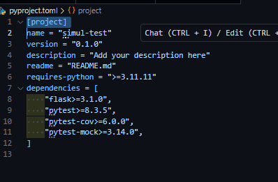

# READ FIRST !!!

## After Clone
1. Setelah clone github ini kalian bisa jalankan beberapa command:
```bash
uv venv
uv init
uv python install 3.11.11
uv python pin 3.11.11
``` 

### 2. add dependencies yang diperlukan 

```bash
# cara cepat 
uv pip install -r requirements.txt
```

!!!!! KALAU COMMAND DI ATAS GA BISA DIJALANKAN !!! 
ADD MANUAL SPERTI DI BAWAH 

### A. kalau pakai "UV ADD"
```bash
uv add flask
# gunakan instalasi dengan --UPGRADE kalau saat kalian run test nanti ada masalah di versi pytest kalian!
uv add pytest               --upgrade
uv add pytest-cov           --upgrade 
```

### B. kalau pakai "UV PIP INSTALL"
```bash
uv pip install flask pytest pytest-cov
```

### C. cek semua dependencies sudah terdaftar di pyproject.toml



# JALANKAN TEST DENGAN COMMAND BERIKUT:

```bash
# jalankan test biasa 
uv run pytest tests/test_coffee.py  # atau nama file kalian 

# jalankan dengan melihat vversi 
uv run pytest tests/test_mock_coffee.py -v


#  jalankan test dan debugging 
uv run pytest tests/test_mock_coffee.py -v --capture=no
```

